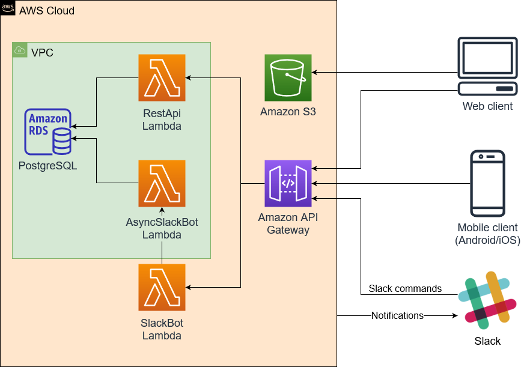

# Parkdude backend

- [Parkdude backend](#parkdude-backend)
  - [Directory structure](#directory-structure)
  - [Architecture](#architecture)
    - [REST API](#rest-api)
    - [Slack integration](#slack-integration)
  - [How to run (development)](#how-to-run-development)
    - [Common prerequisites](#common-prerequisites)
      - [Local database setup](#local-database-setup)
    - [Method 1: Local express server](#method-1-local-express-server)
    - [Method 2: Local API gateway with SAM](#method-2-local-api-gateway-with-sam)
    - [Method 3: Deploy to AWS](#method-3-deploy-to-aws)
  - [Database migrations](#database-migrations)
  - [Testing](#testing)
  - [Linter](#linter)
  - [Admin user configuration](#admin-user-configuration)
  - [Slack integration](#slack-integration-1)
  - [Google login configuration](#google-login-configuration)
  - [Production deployment](#production-deployment)

## Directory structure

- `/app` Contains all Express related code. Most of the logic lies here.
  - `/controllers` Contains modules which process requests and provide responses. Controllers should mostly call service functions and not communicate with databases directly.
  - `/e2e-tests` Contains end-to-end tests (more details in testing section).
  - `/entities` Contains database entities.
  - `/middlewares` Contains preprocessors, validators, wrappers, etc.
  - `/migrations` Contains database migration files. These are mostly autogenerated by TypeORM.
  - `/services` Contains modules which contain most of the main logic, such as communication with databases.
  - `/utils` Contains general helper functions/classes.
- `/bin` Contains executables
- `/build` Contains build output. Output is used by lambda functions and in deployment.
- `/cdk.out` Cloudformation output given by cdk. Used in deployment.
- `/coverage` Contains coverage reports generated by Jest.
- `/env` Contains environment variable files.
- `/handlers` Contains lambda handler functions.
- `/lib` Contains general library modules, basically CDK stack definitions.

## Architecture

Parkdude project consists of four parts: Web client, mobile client, Slack integration and backend. Web and mobile clients are in their own repositories. Below is a high level architecture diagram.

Backend is primarily a serverless application implemented with AWS Lambdas. The REST API however also works as a traditional Express server, which can be useful in local development.

AWS stack is defined with AWS CDK ([ParkdudeBackendStack](./lib/parkdude-backend-stack.ts)), which defines all AWS component configurations.

API Gateway forwards all requests either to RestApi lambda or to SlackBot lambda. RestApi lambda contains most of the application logic and does its internal route handling with ExpressJS. It also handles authentication.

VPC is used to have a virtual network so that lambdas can communicate with the PostgreSQL database, hosted with Amazon RDS.

Amazon S3 is used to host the static files of the web client.

### REST API

All REST API paths are defined in [router.ts](./app/router.ts). There is no separate documentation for the paths, but all body and response interfaces have been defined with TypeScript. All interfaces can be found in [/app/interfaces](./app/interfaces) directory. Controllers in [/app/controllers](./app/controllers) can be checked for more exact details on expected parameter/body types.

### Slack integration

Slack command functionality is split between two lambdas, SlackBot and AsyncSlackBot. The reason for this is that Slack requires every Slack command to respond something in 3 seconds. Due to Lambda cold starts more complicated requests could sometimes take slightly more than 3 seconds. To get around this, SlackBot lambda is the one that receives all requests and sends the initial response.

Simple requests that don't require db access can be responded directly by SlackBot lambda. For more complicated Slack commands SlackBot lambda sends an "empty" response, which tells Slack that the command has been received. It then starts AsyncSlackBot lambda which does the actual command processing and then sends the response to Slack.

Slack integration also works in other direction. RestApi lambda can send "notifications" about events, such as parking spot reservations/releases, via a Slack webhook.

## How to run (development)

There are three possible ways to run development environment: with local express server, with local api gateway or by deploying to aws.

### Common prerequisites

- Node version 10.x or newer (https://nodejs.org/en/)
- `npm install` To install dependencies.
- PostgreSQL database (instructions below)
- Copy file `env/app.dev.example.env` as `env/app.dev.env` and modify if necessary.
- Copy file `env/app.sam-dev.example.env` as `env/app.sam-dev.env` and modify if necessary.
- Copy file `env/app.prod.example.env` as `env/app.prod.env` and modify if necessary.
- Copy file `env/app.test.example.env` as `env/app.test.env` and modify if necessary.
- Optional: Configure [Slack integration](#slack-integration)
- Optional: Configure [Google login configuration](#google-login-configuration)

#### Local database setup

There are many ways to set up the database, but one of the easiest ways is docker.

Database setup with docker:

1. `docker run --name parkdude-db -e POSTGRES_PASSWORD=password -p 5432:5432 -v parkdude-db-volume:/var/lib/postgresql/data -d postgres:11.5` Creates docker container and assigns it with a volume. Different password can be selected. Note that [Postgres 12 does not currently work correctly with Typeorm](https://github.com/typeorm/typeorm/issues/4573), so version 11 should be used.
2. `docker exec parkdude-db createdb -U postgres parkdude` Creates the database
3. `docker exec parkdude-db createdb -U postgres parkdude-test` Creates the database that's used for the tests.
4. `npm run typeorm:migrate` To apply database migrations. Needs to be run whenever migrations change (see Database migrations section for more details).

If you ever need to fully restart the database, run `docker exec parkdude-db dropdb -U postgres parkdude` and `docker exec parkdude-db createdb -U postgres parkdude`.

Container can be stopped with command `docker container stop parkude-db` and (re)started with `docker container start parkdude-db`.

If you use a different database configuration, make sure to change `env/app.dev.env` as necessary.

### Method 1: Local express server

Easiest way to run REST API is to run it as a normal Express server. Do note that this does not work exactly the same as it would with lambdas and API gateway. With this approach it's more important to make sure that application does not rely on any internal state. In production new Express "app" might be created for each request.

Development:

1. `npm run dev` (Launches REST API server at http://localhost:3000, and automatically restarts on code changes. Restart can also be manually triggered by writing `rs` to the console.)

### Method 2: Local API gateway with SAM

SAM can be used to accurately test API gateway and lambdas. It uses Docker behind the scenes to simulate the gateway. The API calls take slightly longer to run than with method 1, since a docker container is started for each request.

Requirements:

- Docker
- Set project directory/drive as shared drive for Docker
- Install [SAM CLI](https://docs.aws.amazon.com/serverless-application-model/latest/developerguide/serverless-sam-cli-install.html). Note: Unlike instructions might claim, AWS account is not needed. Only steps 5+ are relevant.

Development:

1. `npm run watch` (compiles code automatically when changed)
2. `npm run sam-api` (generates template.yaml and launches REST API at http://localhost:3000/api)

As long as `watch` and `sam-api` are active, all code changes are applied immediately.

Note that CORS might not work correctly on some versions of SAM cli.
This might make it not suitable to be tested with frontend.

### Method 3: Deploy to AWS

Prerequisites:

- AWS CLI setup.
  - Installation can be done using for example pip: `pip install awscli`.
  - Create AWS CLI user credentials (only needed once, or when aws iam configurations are changed). For this step you need to login to console.aws.amazon.com and go to AWS IAM User section. Create a user with _programmatic access_. Save the user's security credentials.
    - Note! User needs to have administrator access to the resources it is creating or updating. Attach policies related to them or AdministratorAccess policy to the user.
  - Configure AWS CLI (only needed once, or when aws configurations are changed). Run CLI command `aws configure` and input the user credentials: _Access key ID_, _Secret Access Key_ and region (_eu-north-1_).

First time deployment:

1. Compile the code: `npm run build`.
2. Synthesize an AWS CloudFormation template for the app: `npm run synth`.
3. First time setup needs to create CDKToolkit as a CloudFormation stack. This can be done using `cdk bootstrap aws://${numeric-identifier}/eu-north-1`. The \${numeric-identifier} is the AWS Account identifier that can be found on the AWS console's IAM page in format 012345678912.
4. Deploy the code to AWS using: `npm run aws-deploy`.

Updating changes to existing stack:

1. Compile the code: `npm run build`.
2. Re-generate the CloudFormation template code if there are AWS stack changes: `npm run synth`.
3. Deploy changes: `npm run aws-deploy`.

## Database migrations

Migrations need to be created for any changes made to database entities.

Once you have done your code changes to an entity, run command `npm run typeorm:generate <migration name>`. Migration name should contain entity name. Migration file should appear in `app/migrations` directory. Remember to add the migration to `app/migrations/index.ts` file.

Migrations can be applied by running `npm run typeorm:migrate`. Latest migration can be reverted by running `npm run typeorm:revert`. For AWS migrations can be run by enabling `TYPEORM_MIGRATIONS_RUN = true` in environment variables. AWS will then check for migration whenever lambda is run. Setting should be set off in production.

If migration requires changes can not be handled by automatically generated migration file, the migration file can be changed manually. One example of such situation would be when some existing database values need to be changed to match new database schema.

All migration files should be committed to version control. Old migration files should preferably not be modified after they have been pushed to master.

## Testing

Unit tests are split into two categories: end-to-end (e2e) and unit tests.

End-to-end tests the functionality by calling the server endpoints that are visible to outside world. These tests use a real database to accurately test the functionality. These tests are currently done by calling Express directly, skipping the API gateway completely. New express instance is however created for each test, so functionality should be very similar. All end-to-end tests are in `app/e2e-tests` directory.

Unit tests typically test a single module or a small amount of related modules. These tests should not use real database. Instead all database operations must be mocked. Unit tests should be implemented as such that they can be run parallel if necessary. Unit test files are located in same directory as the module they are testing.

Jest is used to run the tests. Currently Jest always runs both end-to-end and unit tests, but these may be separated later if necessary.

Tests use different database from the one used for development. Database tables are dropped and recreated based on entity schemas at start of the test run. End-to-end tests should ensure that tables are cleared after tests (e.g. with `afterEach` or `afterAll`) so that existing values won't affect other test cases. Tests are run sequentially, so race conditions shouldn't be a concern as long as asynchrous functions are awaited correctly.

Test commands:

- `npm test` Runs all tests once
- `npm test <filter word>` Runs all test files which contain "\<filter word\>". For example `npm test parking` runs all test files with word "parking".
- `npm run test:watch` Watches for file changes and runs the tests automatically
- `npm run test:coverage` Runs all tests once and calculates code coverage. Output is shown both in console and outputted to `coverage` directory.

## Linter

Eslint is used to keep code style consistent and to more easily find bugs. To see linting errors, you'll need to install Eslint plugin which is available on most code editors, such as Visual Studio Code.

The rules are somewhat strict (based on Google's ruleset with some modifications), which is why you'll most likely want to enable auto fix on save, which automatically formats the code and fixes any minor issues. On Visual Studio Code this setting is "eslint.autoFixOnSave", but it might be different for other editors. Eslint might conflict with other formatters, so if they start causing issues you may want to disable them for TypeScript files of this project.

Linting can be run for all files with `npm run lint`.

## Admin user configuration

Database does not have any admin users by default.
To create the first admin, launch the backend and go to `/api/auth/initialise-admin`.
This will create the admin from credentials provided to environment file.
This only works if no other admins exist in the system.
It is recommended to remove this admin once first "real" admin users have been created.

## Slack integration

Parkdude has two integrations with Slack. Slack webhooks are used to send notifications from Parkdude backend to Slack to display messages when reservations have been made or removed. Slack commands are used in Slack to get information on reservation status from backend. Setting the integration requires a small amount of manual work.

1. Create new Slack application (https://api.slack.com/apps?new_app=1). Give it a name (e.g. `Parkdude`) and assign it to desired workspace.
2. `Add features and functionality` -> `Incoming Webhooks`.
3. Enable webhooks and add a new webhook. Assign a channel for the webhook to which the notifications will come.
4. Copy webhook url and add it to `SLACK_WEBHOOK_URL` in environment variable file (`env/app.prod.env` for production).
5. Return to `Basic information` -> `Add features and functionanility`. Select `Slash Commands`.
6. Give command name (e.g. `/parkdude`), description, usage hint (e.g. `[status|help]`) and request url. Request url is in format `https://{backend-api-root}/api/slack`.
7. Return to `Basic information`
8. In App Credentials, copy `Signing secret` and add it to `SLACK_SIGNING_SECRET` in environment variable file (`env/app.prod.env` for production).
9. Optional: Add app icon for the application under `Display information` section.
10. Redeploy Lambda for changes to take effect.

If there ever comes a need to reset the signing secret, it can be done in the App Credentials section. The environment variable for lambda needs to be updated accordingly.

## Google login configuration

Google OAuth credentials are needed for Google login to work.

1. Create new project in Google developer console (https://console.developers.google.com/projectcreate)
2. In [Credentials](https://console.developers.google.com/apis/credentials) -> "Create credentials" -> "OAuth client ID".
3. Select "Web application"
4. For authorised origins add host of the backend. For AWS this can be done after first deployment, if custom domain is not configured. For local development `http://localhost:3000` can also be added.
5. For redirect URIs add the paths below. Localhost paths can also be optionally added for local usage. Note: For autogenerated domains `/prod` must be as part of `HOST`. These can be modified later if needed.
   - HOST + `/api/auth/google/callback`
   - HOST + `/api/auth/google/callback/mobile`
6. Client id and secret are provided. Copy these and add to environment file(s).
7. Test that Google login works both in web and mobile clients.

## Production deployment

Start by going through sections [Common prerequisites](#common-prerequisites) and [Method 3: Deploy to AWS](#method-3-deploy-to-aws).

One part that must be done in early parts of the deployment is setting up environment variables in `env/app.prod.env`, a template from which can be copied from `env/app.prod.example.env`. The file has some hints on what should be put there.

Note that deployment needs to be done in multiple parts, since HOST is only known after first deployment.

Frontend is not deployed automatically. Quick instructions on that:

1. Go to frontend repository, and configure environment variables to point to the backend.
2. Run build in the repository (`npm install`, `npm run build`)
3. Go to AWS console, find the bucket and copy the contents of `build` directory to the bucket. The content should go to the root, so that `build` directory itself is not copied.

If frontend uses a custom domain, it should be configured in `FRONTEND_HOST` environment variable.
